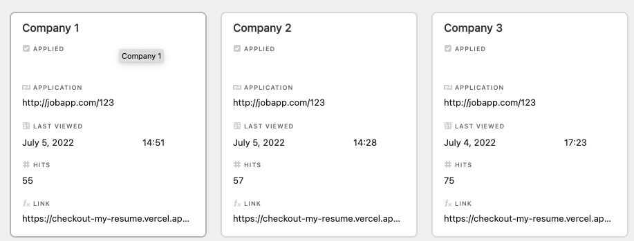
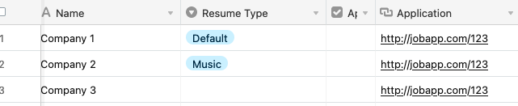

# Checkout My Resume

## About

Checkout my resume allows you to create different resume versions using [Sanity](https://sanity.io), and share them with different companies at unique url. You manage this in Airtable, where you can choose the resume version and get the url to send out. The number of hits and last visit are logged in the same row in Airtable.

  

## Setup 

It's a monorepo `/web/` is the nextjs folder and `/studio` is the sanity folder

### Sanity

1. Create a free account at [Sanity](https://sanity.io).
2. Generate an API token 
3. Set the API information in `web/.env.local` 
4. Create a resume, person and at least one section and job.
### Airtable

1. Copy the base from this the template [here](https://www.airtable.com/universe/exphh8msDvb8QxQf7/checkout-my-resume)
2. Change the formula for the link field to your website and <your-name>
3. Change the formula for localhost to <your-name>

### Next.js
1. Set the env variables .env.local for local use, or in the enviroment you deploy to
2. Deploy
3. You can add templates in `/templates`

## Creating a resume
Go to the sanity studio
